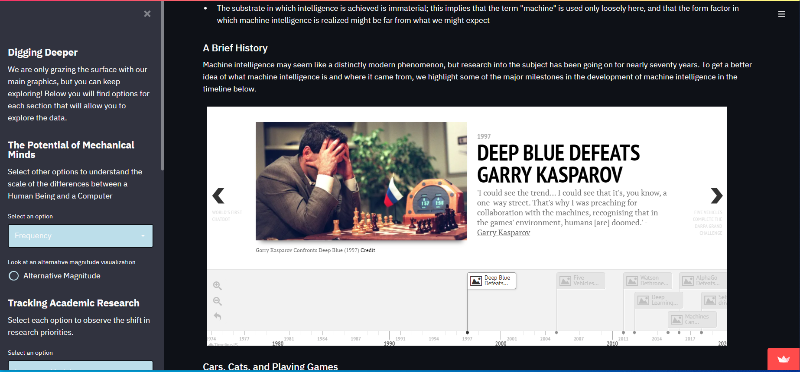
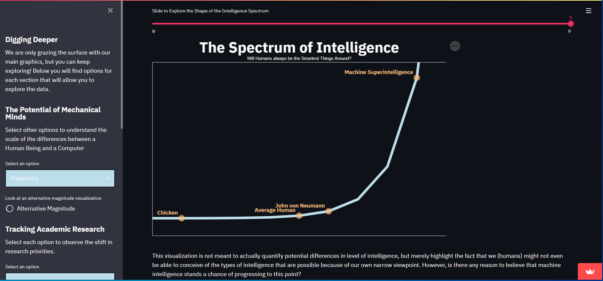
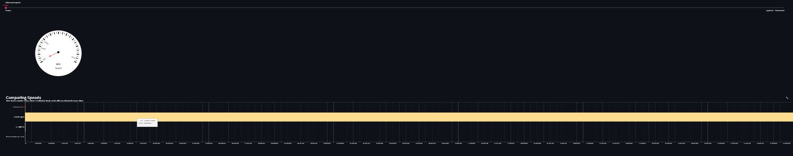
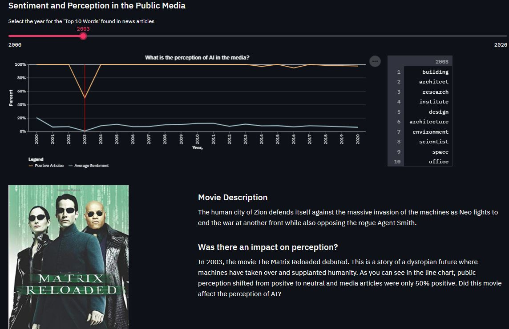
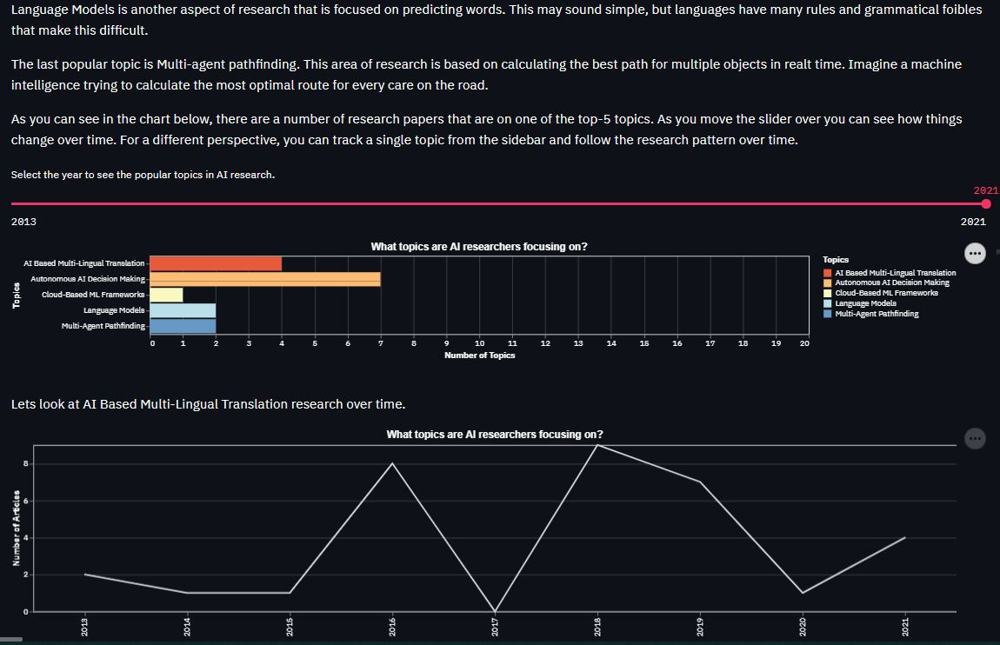
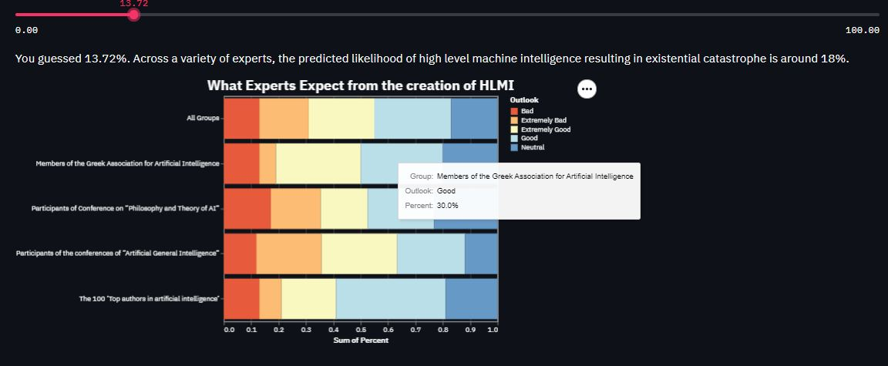
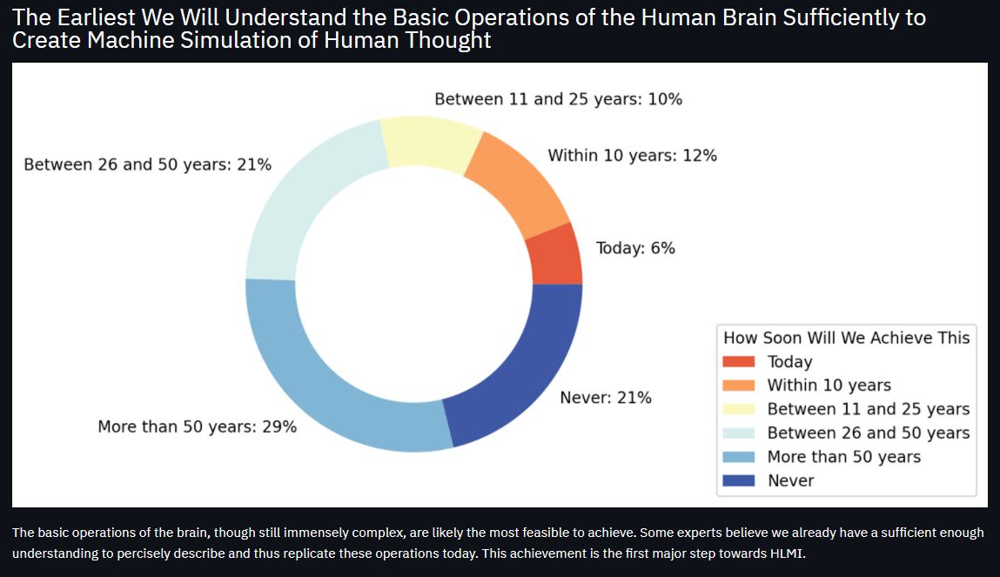
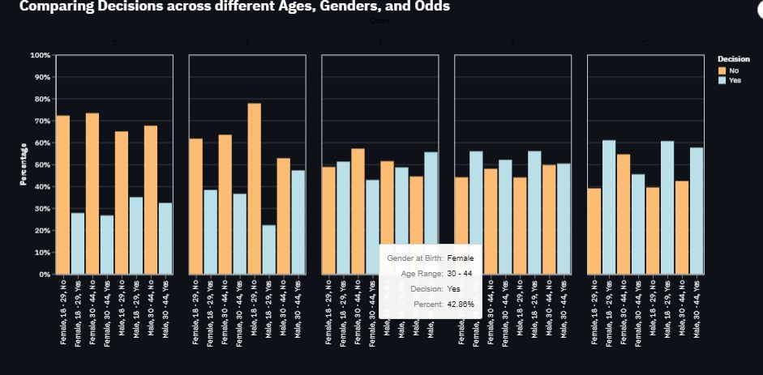
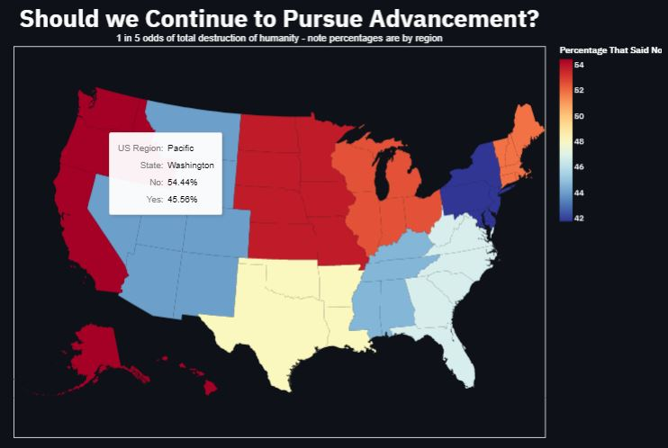
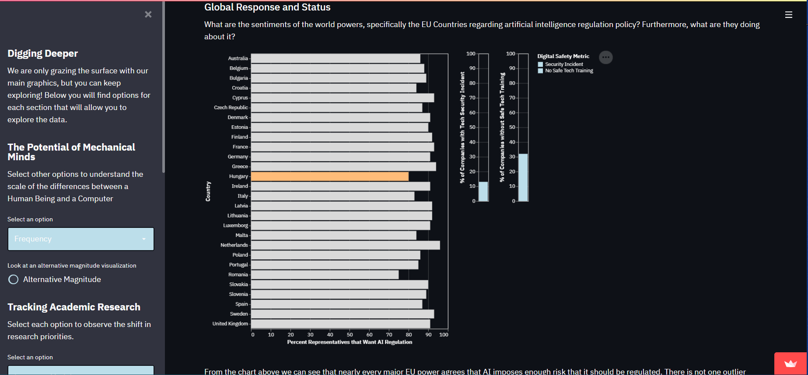

# Final Project Report

### Machine Intelligence: Risks and Opportunities

**Authors**

- Abby Vorhaus
- Jeff Moore
- Will Borom
- Kyle Dotterrer

**Project URL**: https://share.streamlit.io/cmu-ids-2021/fp--05839-abby-jeff-kyle-will/main

**Abstract**: Machine intelligence stands to become one of the most disruptive innovations of our generation, imposing consequence that will span many diverse fields of human endeavor: technological, social, political, and ethical. In this project, we present a data-driven narrative regarding the development of machine intelligence the and its implications for humanity. We contribute a streamlit application that guides users through the often-complex space of machine intelligence potential, ongoing coverage from both popular and academic sources, and the current state of national attention to the subject. Users should come away with a better understanding of _why_ machine intelligence matters, _where_ the technology currently stands, and _what_ we as a society are (and are not) doing to prepare for its arrival.

### Introduction

Machine intelligence, and the prospect of machine superintelligence, is one of the most consequential issues of our generation. While it stands to reason that machine intelligence might prove remarkably beneficial to humanity, there is also a non-negligible probability that its inception might spell the end of life as we know it. The juxtaposition of these two potential outcomes is one of aspects of this topic that makes it susceptible to hijacking by emotional appeals and arguments. In this project, we aim to provide readers with a deeper understanding of both the risks and opportunities posed by the development of machine intelligence in a rigorous, data-driven manner.

**Aside** On a more general level, the problem we address in this project extends beyond just the field of machine intelligence to a broader issue. Why is machine intelligence a difficult topic about which to communicate effectively? We believe the answer lies in the following observations:

- Machine intelligence is a topic that demands some level of technical competence to fully understand.
- Machine intelligence has great potential for disruptive effects in our society. People (in a general sense) are naturally unreceptive to radical ideas that predict massive changes in their mode of living. Furthermore, expectations regarding machine intelligence have been warped by continued attention to relatively-unimportant aspects of the field in the public sphere.

Machine intelligence is not the only topic that meets these criteria. Indeed, many other important issues facing humanity appear to present a similar character: resource depletion and ecological destruction and nuclear weapons development provide two additional examples. How do we communicate effectively about topics like this? Topics that obviously deserve attention and demand that we bring our keenest intellect to bear upon them, yet actively resist treatment that is unhindered by bias?

### Related Work

One of the primary reasons that we selected this topic is the inadequacy of prior work that we perceive in this area. This is not to say that all existing sources of information on machine intelligence are inadequate; on the contrary many high-quality sources exist, and we used several of these to develop our application. The issue lies in the degree of accessibility of these sources, or rather their lack of accessibility. Most work on the topic of machine intelligence is in the form of journal articles, academic papers, or full-length books. Journal articles and academic papers are largely inaccessible to a popular audience by their very nature - they are intended to be read by an audience that is already familiar with the field. Books, while intended for a popular audience, often suffer lower readership than other potential mediums because of the greater investment of time and effort they require. In this project we aim to begin to fill this gap by combining the rigor the aforementioned sources with a greater degree of accessibility.

Our interest in was topic is inspired by a variety of sources. Among the most prolific and influential voices on the topic of machine intelligence is the philosopher Nick Bostrom, whose work dominates the [reference](#references) section. His seminal work on the topic of machine intelligence, _Superintelligence: Paths, Dangers, Strategies_, provides the foundation for many of the ideas that we attempt to impart in this project. In addition to his book, Professor Bostrom is also the author of many influential essays and articles on the topic of machine intelligence that are archived on [his personal website](https://www.nickbostrom.com/). We referenced a number of these articles while developing the narrative for our application. The important thing to note, however, is that Professor Bostrom's style of communication often leaves something to be desired in terms of its accessibility to a popular audience.

Aside from Professor Bostrom's writings on the subject, a number of other public intellectuals have produced treatments of machine intelligence in various forms. Two of the most popular are audio recordings in the form of podcasts and recorded live presentations such as TED talks. See our [reference](#references) for examples of both of these types of sources that we consulted while working on this project.

### Methods

Machine intelligence is a large topic with many distinct aspects worthy of consideration. Therefore, the first step we took in designing our application was to ask the question: what is the subset of available information that we would like to present in our application? Answering this question reduced to another, more well-defined one: what do users need to know about machine intelligence? In answer, we developed the set of questions shown in the table below. In addition, we also identified what we thought of as the "mainstream objection" to the question, or why one who is not familiar with the topic might dismiss it as unimportant or otherwise unworthy of considerable attention. Finally, for each question, we developed a short proposed narrative that we intended to pursue in our application.

| Question | Mainstream Objection | Proposed Narrative |
| --- | --- | --- | 
| What is machine intelligence? Where did it come from? | Machine intelligence is a modern phenomenon that, while at times interesting, is little more than a technical curiosity, much like the robotics technologies showcased by companies like Boston Dynamics. | It is true that much of the popular "hype" surrounding machine intelligence research and its milestones is often concerned with use cases that either do not appear practically applicable or do not demonstrate capabilities that warrant sustained attention. Such coverage, however, often misses the point. The technological innovations that back these apparently-trivial milestones often represent major achievements that precede their expected arrival dates by years or even decades. Furthermore, the capabilities showcased in these examples often fail to consider the primacy of intelligence. |
| Why is machine intelligence important? | Most popular coverage of machine (or, more commonly, artificial) intelligence seems to deal with a trivial matters like machines beating humans at games like chess or StarCraft. It is a long way from Stockfish to anything that warrants attention. | Intelligence is the underlying source of power and control in the modern world. There are many reasons to believe that a machine intelligence will far surpass human intelligence along most dimensions of interest. |
| How has the developent of machine intelligence evolved over time? How does this compare with the way it is potrayed in popular media? | If machine intelligence is as important a topic as we claim, it must be the case that additional research effort is being brought to bear upon the inherent safety concerns. Popular media presents the relevant aspects of developments in machine intelligence. | Initiatives that take machine intelligence safety research as their primary concern are growing in number, but not at a rate that is commensurate with the overall rate of progress in the field. Public sentiment regarding machine intelligence is largely shaped by popular culture phenomena, rather than way in which the state-of-the-art research in the field is developing. |
| What do my neighbors think about the prospects of machine intelligence? How does this compare with what the experts think? | Experts in machine intelligence must have some idea of when general machine intelligence might arise as a result of our continuing research efforts. | Even among experts in the field, there does not exist a general consensus as to the potential arrival date for general machine intelligence. This is an extremely worrying situation considering the massive potential for disruption posed by the technology. |
| What is being done to address the potential issues posed by the development of machine intelligence? | Worrying about imposing oversight or otherwise regularing machine intelligence research constitues a waste of time and attention. | Most of the world's national powers have publicly expressed interest in imposing regulations on machine intelligence research and development efforts, but few have taken steps towards doing so. |

As with any narrative project, our primary goal is the effective communication of information. To this end, the organizing method for our application is to combine narrative elements with relevant visualizations to produce an engaging user experience. We organize our narrative into distinct thematic sections (which we refer to as "chapters"), each of which deals with a particular aspect of the topic of machine intelligence. The objective of each section, along with the specifics of the methods we used to realize the objective, are described below in further detail. 

#### Defining Machine Intelligence

 We begin our narrative with a definition of machine intelligence along with some background information that is useful in contextualizing the rest of the narrative.

**Dataset(s)** Multiple Sources.

**Method** On its own, a definition is far from informative or compelling. To address this, we combine our definition of machine intelligence with an overview of the technical and social milestones in the field. This serves to contextualize the remainder of the narrative and gives the reader some of the background knowledge that is assumed later in the narrative.

The obvious choice for presenting time series information in this manner is an interactive timeline. While searching for ways to create timelines in streamlit, we found the `streamlit_timeline` library, which makes generating aesthetically pleasing timelines in streamlit applications simple. Once we had the infrastructure in place, all that remained was populating the timeline with events of interest. We selected a diverse set of events for the timeline, including both cultural and technical milestones. The one thing that all of the events have in common, however, is that it is difficult to make an immediate connection between the capabilities of machine intelligence implied by the event and the capabilities that potential disruptive capabilities of the technology. This design is deliberate. Our goal is for users of the application to come away from this section with the feeling that while the milestones in machine intelligence are interesting achievements, they do not necessarily represent a cause for an increased degree of attention. In other words, one is left with the question: "is this a topic that is really worth worrying about"? It is to this question that we turn in the next section.

#### Machine Intelligence as a Paradigm Shift

The purpose of the next chapter of our narrative is to impress upon our users the idea that, far from being just another new technology, machine intelligence will likely represent a true paradigm shift for human civilization.

**Dataset(s)** Prior Analysis by Nick Bostrom.

**Method** The first issue we tackle in this section is the primacy of intelligence - why does intelligence, as an abstract concept, matter to us? The fist part of this section is entirely narrative; we failed to formulate a compelling visualization that illustrates the idea: "intelligence is what allows us to achieve what we value," but the idea is simple enough on its own. Following this, we attempt to demonstrate the fact that our human understanding of the spectrum of intelligence is likely altogether too narrow. To this end, we utilize an interactive line chart that makes the revelation of the relative position of human intelligence and machine intelligence dynamic.

Following this section on the primacy of intelligence, we attempt to impress upon readers some degree of justification for the claim that the capabilities of machine intelligence will far outstrip human intelligence. We adopt the approach of enumerating some of the distinctions between biological and machine substrates, specifically:

- Processing Speed: Biological neurons fire at approximately 150hz. The processor in a standard desktop computer operates at 2GHz - a frequency that is 7 orders of magnitude greater.
- Propagation Speed: Signals propagate in biological axons at a rate of 200m/s. In contrast, the signals in an integrated circuit that power a machine intelligence propagate at the speed of light.
- Capacity: Intelligence in biological substrate is bound by fundamental biological limits. For instance, the total size of the human brain is fundamentally limited by the size of our cranium, as well as our potential for energy input and output bandwidth. Intelligence in machine substrate faces no such limitations.

For each of these dimensions, we attempt to illustrate the distinction in magnitude between the capabilities of a machine intelligence and human intelligence. To this end, we use a combination of easily-digestible graphics and bar charts. In aggregate, we hope that users come away from these visualizations with the felt sense that machine intelligence is indeed a technology with impressive potential.

#### Evolving Perceptions of Machine Intelligence

In the next chapter of our narrative, we consider perceptions of machine intelligence from both popular and professional points of view.

**Dataset(s)** Nature (popular articles dataset), Journal of Artificial Intelligence Research (professional articles dataset)

**Method** Our goal in this section is impart two important ideas regarding how 

**Limitations** In our application, we failed to 

#### Prospects for Machine Intelligence

**Dataset(s)** [Artificial Intelligence, American Attitudes and Trends](https://governanceai.github.io/US-Public-Opinion-Report-Jan-2019/addresults.html)

#### Responding to Potential Risks

In the final chapter of the narrative we consider the ongoing response to the development of machine intelligence.

**Dataset(s)** [EU Data Eurostat](https://ec.europa.eu/eurostat/web/main/data/database)

**Method** In this section we attempt to visualize one aspect of the global response to the development of machine intelligence. Specifically, we consider the results of a poll of political leaders from the European Union who were presented with questions regarding their thoughts on regulation of machine intelligence research efforts. We plot the results of this poll in a bar chart, illustrating widespread consensus on the topic.

In addition, we present a case study of self-driving car regulation. The purpose of this case study is to provide a data point on how issues of regulation of autonomous systems have been handled in the past. Obviously the connection between a narrow application of autonomy like self-driving vehicles and general machine intelligence regulation is somewhat tenuous, but we felt this was necessary considering the scarcity of data on this particular sub-topic (see below).

**Limitations** There is a noticeable lack of data available on the topic of AI regulation and oversight efforts. We made the most of the one dataset that we were able to find on the subject, but the total information content this provided was somewhat disappointing. We would like to have more to say on this particular aspect of the narrative.

### Results

Examples of the visualizations we produced for each chapter of our narrative are provided below.

#### Defining Machine Intelligence

#### Machine Intelligence as a Paradigm Shift

#### Evolving Perceptions of Machine Intelligence

#### Prospects for Machine Intelligence

#### Responding to Potential Risks

### Discussion

Overall, we hope that users of our application come away with the following realizations:

- Machine intelligence is not a modern phenomenon; research on this topic has been ongoing for nearly seventy years, at varying degrees of intensity.
- The events and milestones related to machine intelligence that are covered in the popular media are not necessarily indicative of the increasing capacity of the technology, nor of its potential.
- There is very strong evidence to support the idea that machine intelligence will represent a globally-disruptive technological innovation.
- Public sentiment surrounding machine intelligence may be shaped to greater degree by popular culture than by actual technical developments within the field.
- Experts in the field of machine intelligence have not reached any strong consensus regarding the point in the future we can expect to achieve general machine intelligence.
- The general public has a surprisingly-high tolerance for potential destruction of the human race as a result of the development of machine intelligence.
- Most national powers agree that _something_ should be done to address the growing capabilities of machine intelligence, but are not yet prepared to actually implement concrete policies to this effect.

### Future Work

We are pleased with both the analyses we performed and the visualizations we produced on the basis of these analyses in our finished product. Much work remains to be done on the topic of effective communication of the current state and future implications of machine intelligence. We identify the following potential areas for future work:

- *Application Aesthetics*: Because of the relative scarcity of publicly-available datasets on the topic of machine intelligence, we spent the majority of our time and effort in this project performing the initial analyses necessary to construct simple visualizations. While these are a nice baseline, they are far from visualization masterpieces. With additional time and attention, we believe that we could utilize the data we have collected to produce more compelling visualizations. Furthermore, we found many instances in which the format of the streamlit application limited our implementation. Streamlit is a great tool for quickly producing an interactive narrative application like this one, but one pays for this efficiency by sacrificing control over the more nuanced aspects of the application. It might be possible to coerce streamlit to render the narrative in precisely the ways that we would like it to, but there is also the possibility that we would need to select a different platform altogether to truly realize our vision.
- *Additional Popular Data Sources*: In our exploration of the coverage of machine intelligence in popular media, we only considered articles from a single source - the magazine Nature. This was a choice we made on the basis of several practical considerations - the relatively high regard in which the magazine is held, combined with the time constraints under which this project was conducted. Future work could expand the sources of information used in this analysis of popular opinion and sentiment regarding machine intelligence. Furthermore, in our current implementation, we only attempt to draw the distinction between popular coverage and professional coverage of machine intelligence. A more nuanced analysis might also consider the distinction among popular media sources, and the potential underlying reasons for these distinctions. 
- *Additional Professional Data Sources*: Similar to our exploration of popular coverage, we only considered a single publication as a data source for professional publications related to machine intelligence. The Journal of Artificial Intelligence Research proved a great starting point for this analysis for a variety of reasons (described in the _Methods_ section above). However, in order to get a more complete picture of professional machine intelligence research and the trends present therein, we should perform a more comprehensive survey of the available literature. Again, we were forced to focus our attention on a single data source within the scope of this project because we invested much of our time performing the initial data collection and analysis necessary to produce baseline visualizations.
- *Consider Narrow Intelligence*: One of the questions with which we were faced during our live presentation of this project pertained to the fact that we spent very little time focusing on the _opportunities_ presented by the development of machine intelligence and instead focused almost exclusively on the _risks_ that it poses. This is an accurate assessment of the current state of our project. The outside attention devoted to the risks of machine intelligence is largely an artifact of our focus on _general_ intelligence scenarios. We might extend this project to encompass more opportunities by also considering the benefits of _narrow_ machine intelligence. Narrow machine intelligence technology is already deployed in a variety of applications throughout society, to great effect and collective benefit. Including examples of such technology would help to balance the narrative.
- *Visualize Decision Theory*: One of the primary risk factors related to machine intelligence reduces to the question: "how do we exercise control over an agent that is necessarily more competent than we are, in every relevant domain?" Searching for an answer to this question is the focus of the sub-field of machine intelligence research and mathematics known as decision theory. We find that this question is one of the most deeply interesting aspects of machine intelligence development, and perhaps the one that is the most difficult to understand, making it an important candidate for inclusion in a project such as this one. Constructing visualizations that meet this objective, however, is a non-trivial undertaking, and we failed to produce any in the course of this project. Future work might further explore potential visualizations in this area.

### References

The datasets that we utilized to generate the visualizations in our application are listed below.

- [Journal of Artificial Intelligence Research](https://www.jair.org/index.php/jair).
- Muller, Vincent and Bostrom, Nick. [Future Progress in Artificial Intelligence: A Survey of Expert Opinion](https://www.nickbostrom.com/papers/survey.pdf). (2016).
- [Nature](https://www.nature.com/).
- Webb, Rick. [Superintelligence and Public Opinion.](https://shift.newco.co/2017/04/24/superintelligence-and-public-opinion/). NewCo Shift. (2017).
- Zhang, Baobao and Dafoe, Allan. [Artificial Intelligence, American Attitudes and Trends](https://governanceai.github.io/US-Public-Opinion-Report-Jan-2019/addresults.html). 2019.

The general references that we utilized during our research for this project are listed below.

- Armstrong, Stuart and Bostrom, Nick and Shulman, Carl. [Racing to the Precipice: A Model of Artificial Intelligence Development](http://www.fhi.ox.ac.uk/wp-content/uploads/Racing-to-the-precipice-a-model-of-artificial-intelligence-development.pdf). 2013.
- Bostrom, Nick. [The Superintelligent Will: Motivation and Instrumental Rationality in Advanced Artificial Agents](https://www.nickbostrom.com/superintelligentwill.pdf). 2012.
- Bostrom, Nick. [Existential Risks: Analyzing Human Extinction Scenarios and Related Hazards](https://www.nickbostrom.com/existential/risks.html). 2002.
- Bostrom, Nick. [The Future of Machine Intelligence](https://www.youtube.com/watch?v=8xwESiI6uKA). 2017.
- Bostrom, Nick. _Superintelligence: Paths, Dangers, Strategies_ 2014.
- Bostrom, Nick. [What Happens When Our Computers Get Smarter Than We Are?](https://www.youtube.com/watch?v=MnT1xgZgkpk&t=326s) TED Talk. 2015.
- [EU Data Eurostat](https://ec.europa.eu/eurostat/web/main/data/database). 2021.
- Harris, Sam. [Can We Build AI Without Losing Control Over It?](https://www.youtube.com/watch?v=8nt3edWLgIg) TED Talk. 2016.
- Harris, Sam and Russel, Stuart. [The Dawn of Artificial Intelligence](https://samharris.org/podcasts/the-dawn-of-artificial-intelligence1/). 2016.
- Harris, Sam and Yudkowsky, Eliezer. [AI: Racing Toward the Brink](https://intelligence.org/2018/02/28/sam-harris-and-eliezer-yudkowsky/). 2018.
- [Machine Intelligence Research Institute](https://intelligence.org/).
- McCarthy et al. _A Proposal for the Dartmouth Summer Research Project on Artificial Intelligence._ 1955.
- Yudkowsky, Eliezer. [AI Alignment: Why it's Hard, and Where to Start](https://www.youtube.com/watch?v=EUjc1WuyPT8).
